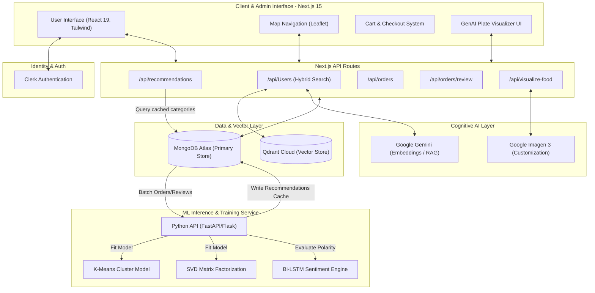

# 🥗 Aahar Ally - Hybrid Intelligent Recommendation System

> **A Research-Driven Approach to Personalized Dining** — Combining Demographic Clustering, Collaborative Filtering, and Sentiment Analysis to bridge the gap between small restaurants and data-driven personalization.

---

## 🌟 The Core Innovation

Most food delivery platforms rely on generic popularity trends or simple discounts. **Aahar Ally** introduces a novel **Hybrid Recommendation Framework** optimized for the "Cold Start" problem and nuanced user preferences.

Based on the research paper *"AaharAlly: A Hybrid Restaurant Recommendation System Using Machine Learning and Sentiment Analysis"*, this platform dynamically adapts to users in three stages:

1.  **For New Users (The "Cold Start" Solution)**: Uses **Demographic Clustering (K-Means)**. We analyze age and gender to map users into existing taste clusters, offering relevant suggestions instantly without any order history.
2.  **For Returning Users**: Uses **Collaborative Filtering (SVD)** to refine recommendations based on individual interaction latent factors.
3.  **Sentiment-Driven Optimization**: We don't just count stars. We use **Bi-Directional LSTM** and Logistic Regression to analyze the *text* of reviews, allowing positive/negative sentiment to re-rank the final recommendations.

---

## 🚀 Key Features

### 🧠 1. The Hybrid AI Engine (Research Core)

*   **Demographic Clustering**: Users are segmented using **K-Means (k=6)** based on age and gender. This mirrors real-world dining patterns (e.g., college students vs. families have distinct aggregated preferences).
*   **Sentiment Analysis**: A dual-model approach using **TF-IDF + Logistic Regression** and **Deep Learning (LSTM)** to capture context in user reviews (e.g., distinguishing "spicy but good" from "spicy and inedible").
*   **Dynamic Retraining**: The system learns from every interaction, constantly refining the vectors used for clustering and recommendation.

<details>
<summary><strong>🩺 2. Dietary Intelligence (Safety Layer)</strong></summary>

*   **Health Conflict Filtering**: Beyond taste, Aahar Ally ensures safety. Users with conditions like **Diabetes** or **Hypertension** get a filtered menu.
*   **RAG Chatbot**: A context-aware assistant that can answer specific medical queries about the menu using accurate nutritional data.
</details>

<details>
<summary><strong>🎨 3. GenAI Plate Visualizer (Visual Confidence)</strong></summary>

*   **Real-Time Modification Previews**: Uses **Google Imagen 3** to visualize changes. If a user asks to "Remove cheese and add olives", the system generates a photorealistic preview of that specific modification to build trust.
</details>

<details>
<summary><strong>📊 4. Restaurant Analytics Dashboard</strong></summary>

*   **Cluster Insights**: Restaurants can see which demographic clusters are engaging most with their menu.
*   **Sentiment Trends**: Track how specific dishes are performing in terms of sentiment, not just sales volume.
</details>

---

## 🏗️ Technical Architecture

The project is structured as a Monorepo containing a High-Performance Frontend and a Research-Grade ML Backend.

### 🛠 Tech Stack

| Component | Technologies |
| :--- | :--- |
| **Frontend** | Next.js 15, React 19, TailwindCSS, Framer Motion |
| **ML Engine** | Python, Flask, Scikit-Learn (KMeans, SVD), TensorFlow (LSTM) |
| **Database** | MongoDB Atlas (Shared Cluster) |
| **Vector DB** | Qdrant (for Semantic Search & RAG) |
| **Auth** | Clerk |

### ML Pipeline Flow
1.  **Ingestion**: Demographics & Order History → **Preprocessing** (KNN Imputer, OneHotEncoder).
2.  **Clustering**: PCA Dimension Reduction → KMeans Clustering.
3.  **Collaborative Filtering**: SVD Matrix Factorization on User-Dish interactions.
4.  **Ranking**: Recommendations are biased by Restaurant Popularity and re-ranked by Sentiment Scores.

---

## 📂 Project Structure

This repository is organized into three main workspaces.

### 1. `website/` (The Application Layer)
The Next.js application hosting the Client Interface and Admin Dashboard.

*   `src/app/`: App Router structure.
*   `src/components/Recommendations.tsx`: The UI component that displays the personalized ML results.
*   `src/app/models/HealthCache.js`: The bridge model connecting to the ML database.

### 2. `ML_Service/` (The Intelligence Brain)
A Python/Flask service deployed on **Render**. It performs the heavy lifting:

*   `app.py`: Exposes the `/api/train` endpoint.
*   **Functionality**:
    *   Fetches live data from MongoDB.
    *   Executes the **KMeans** and **SVD** pipelines.
    *   **Writes results** to the `aahar_ally_ml` database.

### 3. `ML/` (Research & Development)
Contains the original Jupyter notebooks used to validate the thesis:
*   `adding_accuracy_checks.py`: Scripts for validating the F1-score and Accuracy of the hybrid model (Achieved ~91.2% Accuracy in pilot studies).

---

## 🚀 Deployment

The project is deployed across two platforms:

1.  **Vercel** (`website` folder): Hosts the Frontend and API.
2.  **Render** (`ML_Service` folder): Hosts the Python ML Engine.

---

## 📐 System Design Deep Dive & Architecture Reference

This section outlines the production-grade High-Level Design (HLD), Low-Level Design (LLD), user flows, and AWS migration path, designed for technical review prep.

### 1. Unified Architecture Diagram



### 2. User Workflows

```mermaid
graph TD
    subgraph New_User_Flow [1. Cold Start Workflow]
        A[New User Registers] --> B[Enter Age & Gender]
        B --> C[API: age_gender_to_cluster]
        C --> D[Assign 1 of 6 demographic cohorts]
        D --> E[Fetch cached cohort popularity from MongoDB]
        E --> F[Display baseline recommendations]
    end

    subgraph Returning_User_Flow [2. Collaborative Filtering Workflow]
        G[Existing User Logs In] --> H[API: /api/recommendations]
        H --> I[Load SVD User-Item Latent Vectors]
        I --> J[Predict category rating frequencies]
        J --> K[Combine with global sentiment weights]
        K --> L[Display personalized recommendations]
    end

    subgraph Safety_Flow [3. Dietary Safety Cortex Workflow]
        M[User Selects Health Condition] --> N[API matches condition to strict healthMap]
        N --> O[Filter results strictly by safe categories]
        O --> P[Return clinical-grade filtered list]
    end

    subgraph Feedback_Flow [4. Sentiment-Aware Review Loop]
        Q[User places Order] --> R[Write Review in Orders Page]
        R --> S[Next.js API forwards review to Python service]
        S --> T[Bi-LSTM evaluates polarity score]
        T -->|Positive| U[Boost category in User.recommendedCategories]
        T -->|Negative| V[Purge category from User.recommendedCategories]
    end
```



#### A. New User (Cold Start)
*   **Trigger**: A user signs up via **Clerk** and lacks order history.
*   **Logic**: During registration, they provide `Age` and `Gender`. The Next.js frontend sends this to `/api/recommend`. The Python ML service maps these parameters through a pre-trained K-Means clustering algorithm ($k=6$). 
*   **Result**: The user inherits the most popular meal categories of their assigned demographic cohort, avoiding blank screens or random recommendations.

#### B. Returning User (Collaborative Filtering)
*   **Trigger**: An existing user with a history of orders logs in.
*   **Logic**: Every order increases the user-item interaction count. Periodically, the **SVD (Singular Value Decomposition)** model retrains. When the user loads the dashboard, the SVD model uses their latent vector to predict preferences across categories they haven't ordered yet.
*   **Result**: Recommendations shift from demographic baselines to individual preference patterns.

#### C. Health-Filtered User (Safety Cortex)
*   **Trigger**: A user selects a condition (e.g., *Diabetes* or *IBS*) from their profile.
*   **Logic**: The app applies a strict, deterministic category restriction to bypass safety issues:
    *   **Diabetes** $\rightarrow$ `["Healthy", "Vegan", "Seafood"]`
    *   **Hypertension** $\rightarrow$ `["Healthy", "Vegan", "South Indian"]`
    *   **IBS / Peptic Ulcer** $\rightarrow$ `["Healthy", "Vegan", "South Indian"]`
*   **Result**: The menu is filtered strictly to safe categories, guaranteeing medical safety.

#### D. Customizing User (Plate Visualizer)
*   **Trigger**: A user requests custom modifications (e.g., *"Make it vegan, add tofu"*).
*   **Logic**: Next.js hits `/api/visualize-food`. Google Gemini translates the text modification into visual prompts, which are sent to **Google Imagen 3**.
*   **Result**: A photorealistic preview of the custom plate is generated to build ordering confidence.

#### E. Vocal User (Sentiment Loop)
*   **Trigger**: The user submits a review in their order history.
*   **Logic**: Next.js sends the text to the sentiment analyzer. The **Bi-LSTM** classifies polarity.
    *   **Positive Review**: Category is pushed to `recommendedCategories`.
    *   **Negative Review**: Category is purged from `recommendedCategories`.
*   **Result**: Immediate dynamic re-ranking of the home feed on next reload.

---

## 🚀 High-Level Design (HLD) Concepts

### 1. Asynchronous Architecture & Decoupled Latency
Running Collaborative Filtering (SVD matrix operations) and Deep Learning (LSTM inference) on every user request is computationally infeasible and violates strict SLA targets (P99 < 200ms).
*   **Solution**: We decouple **Inference** from **Training**.
*   The Flask/FastAPI service trains SVD and Bi-LSTM offline in background threads or cron triggers.
*   The results (User Latent Vectors and Category Sentiment Multipliers) are written into a **MongoDB caching layer**.
*   At request time, Next.js performs a simple read from MongoDB. This keeps response times sub-20ms.

### 2. Microservice Isolation (Next.js vs. Python ML)
Python machine learning libraries (TensorFlow, PyTorch, Scikit-learn) have large binary dependencies, inflating serverless bundle sizes and causing huge cold start times on serverless environments like Vercel.
*   **Solution**: Next.js handles the user-facing application layer (Vercel serverless). The heavy ML computation is containerized and hosted separately on Render or AWS ECS/Fargate, communicating over a lightweight JSON API.

---

## 📐 Low-Level Design (LLD) Concepts

### 1. Matrix Factorization (SVD)
The SVD algorithm decomposes the implicit rating matrix (user order counts) $R$ of dimensions $m \times n$ into three matrices:
$$R \approx U \cdot \Sigma \cdot V^T$$
Where:
*   $U$ is an $m \times k$ user-feature matrix.
*   $V$ is an $n \times k$ item-feature matrix.
*   $\Sigma$ is a diagonal matrix containing singular values representing the strength of the $k$ latent factors (we set `n_factors = 50`).

### 2. Wilson Score Interval for Sentiment Reranking
To prevent a niche item with only 1 positive review (100% positive) from outranking a popular item with 900 positive out of 1000 reviews (90% positive), we use the **Wilson Score Interval** to calculate the lower bound of the confidence interval:
$$S = \frac{\hat{p} + \frac{z^2}{2n} - z \sqrt{\frac{\hat{p}(1-\hat{p})}{n} + \frac{z^2}{4n^2}}}{1 + \frac{z^2}{n}}$$
Where $\hat{p}$ is the fraction of positive reviews, $n$ is the total reviews, and $z$ is the confidence level parameter (commonly $z=1.96$ for a 95% confidence interval). This pulls untested items toward the global mean.

### 3. Next.js React Hooks Breakdown
We leverage React 19 Client hooks for state and side-effect orchestration:

*   **`useState`**: Used to manage localized UI states (e.g., `items` for recommendations, `loading` state, `reviewText` values).
*   **`useEffect`**: Triggers side effects like fetching order lists on mount, synchronizing state with local storage, and checking Clerk profile completeness.
*   **`useRef`**: Bypasses the React render loop. Used for tracking mutable flags like `ignoreNextEffect` to prevent infinite loops when bi-directionally syncing filters between state changes and query parameters.
*   **`useSearchParams`**: Reads current URL queries (like `?health_condition=Diabetes`) enabling shareable links and reliable back/forward browser history.
*   **`useUser` (Clerk)**: Inspects the active user session and pulls demographic data securely from metadata.

---

## ⚡ FastAPI Migration

Originally implemented in Flask, high-volume production deployments benefit from a migration to **FastAPI**:

*   **Why FastAPI?**: 
    1.  **Asynchronous I/O (`async/await`)**: Next-gen async loop allows FastAPI to handle thousands of concurrent requests while waiting for database reads (MongoDB) or Gemini APIs, without blocking threads.
    2.  **Pydantic Validation**: Automatic type validation and descriptive serialization errors.
    3.  **Performance**: Outperforms Flask by 2x-5x on high-concurrency benchmarks by running on Uvicorn.

```python
# FastAPI Route Translation example:
from fastapi import FastAPI, HTTPException
from pydantic import BaseModel

app = FastAPI()

class RecommendRequest(BaseModel):
    user_id: str
    age: float
    gender: str

@app.post("/api/recommend")
async def recommend(payload: RecommendRequest):
    try:
        # Perform SVD & Cluster mapping asynchronously
        return {"success": True, "recommendations": ["Healthy", "Vegan"]}
    except Exception as e:
        raise HTTPException(status_code=500, detail=str(e))
```

---

## ☁️ AWS Deployment Architecture

For an enterprise deployment, AaharAlly can transition from Render/Vercel to a highly available AWS infrastructure:

```
                  [ AWS Route 53 (DNS) ]
                            │
              [ AWS CloudFront (CDN Cache) ]
                            │
              [ Application Load Balancer ]
             ┌──────────────┴──────────────┐
             ▼                             ▼
    [ Next.js Frontend ]        [ Python ML Microservice ]
    (AWS ECS on Fargate)        (AWS ECS on Fargate / SageMaker)
             │                             │
    ┌────────┴─────────────────────────────┴────────┐
    ▼                                              ▼
[ MongoDB Atlas ]                          [ Qdrant Cloud ]
(Managed Data)                             (Vector Database)
```

### ECS Fargate Service Separation
*   **Service A (Frontend)**: Dockerized Next.js application running on ECS Fargate. Autoscales horizontally based on HTTP Request Count.
*   **Service B (ML API)**: FastAPI microservice running on ECS Fargate. Autoscales based on CPU/Memory consumption to accommodate heavy model loads.
*   **Decoupled Batch Training (SageMaker)**: The model retraining script (`index-qdrant.js` and SVD fitting) is offloaded to **AWS Batch** or **AWS SageMaker Jobs**. This runs on a schedule (triggered by AWS EventBridge) to ensure web containers never compete for resources with training algorithms.
*   **Security & Network isolation**: Managed inside a custom VPC. Database layers are isolated in private subnets, while the ECS containers sit behind an Application Load Balancer (ALB) acting as a secure gateway.
